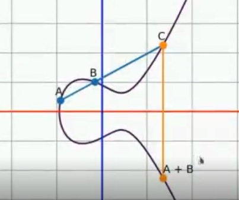
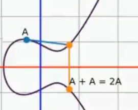

# Krzywe eliptyczne

## Aksjomaty w krzywych eliptycznych ( Zdefiniowane działania ) - główne apsekty w kryptografii

* Krzywa eliptyczna jest zdefiniowana nad ciałem Zp, gdzie Z to liczby całkowite, a p to jakaś liczba pierwsza (w skrócie używa się liczb całkowitych modulo liczba pierwsza)

* Dodawanie punktów - jeśli trzy punkty (A, B, C) są współliniowe to ***A + B + C = 0***.

* Negacja punktu - Negacją punktu A = ( x0, y0 ) nazywamy punkt mający współrzedzne ***( x0, -y0 )*** i oznaczamy ***-A***.

---
 
- Zgodnie z powyższymi aksojamatami możemy zdefiniować dodawanie dwóch punktów:        

    

    Skoro *A + B + C = 0* => *A + B = -C*, jeśli następnie znegujemy punkt *C* otrzymamy *-C*, czyli *A + B*.

---

* Łączność dodawania - ***A + (B + C) = (A + B) + C***.

* Podwajanie punktów - to nic innnego jak styczna do punktu, która przecina tą prostą w pewnym punkcie (np. B). Powstaje nam trzeci punkt, który jest współliniowy z A (czyli ***A + A + B = 0 => 2A = -B***). Po negacji nowego punktu otrzymujemy punkt 2A.

    

    Skoro mamy punkt 2A (jak również A) można dalej mnożyć przez liczbę czyli dodawać do siebie punkty 3A = 2A + A itp.

* **NIE** zdefiniowe jest dzielenie np. skoro B = n * A, to nieobliczalne jest n, znając tylko A i B (nie istnieje A/B)

---

Stąd też liczby n używa się jako klucza prywatnego, a B jako klucza publicznego. Współdzielonymi danymy są:

- krzywa eliptyczna - E
- punkt A

Znając A oraz B atakujący próbuje poznać n, gdzie pojawia się bariera złożoności obliczeniowej.
